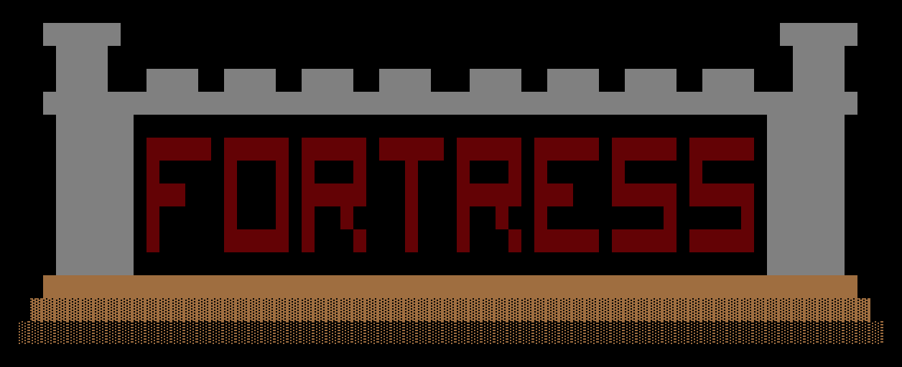

# Fortress

> Fortress is a package of game development utilities for Dart and Flutter apps. It includes
> renderers, an extensible game loop, basic UI elements, map generators and more!

  

Fortress is specifically for retro-style, grid-based games like roguelikes and Dwarf Fortress
clones, but could work for anything tile-based with retro/ASCII pixel graphics.

Fortress was heavily influcenced by the the work of [Bob Nystrom](https://journal.stuffwithstuff.com/),
both his [writing](https://gameprogrammingpatterns.com/) and his
[code](https://github.com/munificent). Indeed, many parts of Fortress are reimplementations
of his work on [piecemeal](https://github.com/munificent/piecemeal),
[malison](https://github.com/munificent/malison), and his own roguelike
[Hauberk](https://github.com/munificent/hauberk) with my own modifications and enhancements. This
was my opportunity to learn more about Dart while exploring more of my gamedev hobby.

## Usage

Fortress is under active development and many of the public APIs will be in flux until the 1.0
version. For now, see example usage in [web/main.dart](web/main.dart) and [web/demo](web/demo/).

To see the demo in action, visit https://alexgladd.github.io/fortress/
